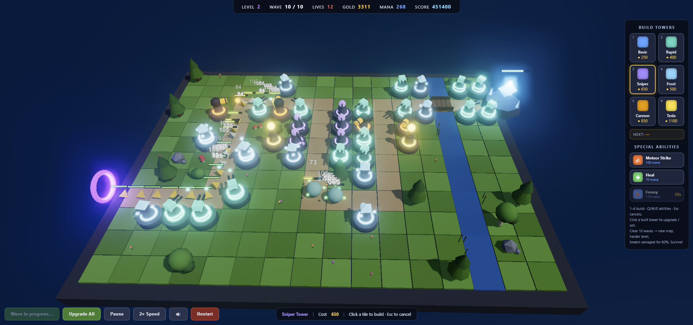

# Crystal Defense

Endless 3D tower defense built with **Vite + TypeScript + Three.js** — daily challenges, mutator drafts, and a global leaderboard. Defend the crystal forever, or until it shatters.



**Endless mode:** each level is 10 waves on a procedurally generated map (random
path, random stream crossing, random foliage). Clear a level and the battlefield
regenerates at a higher difficulty: your towers are salvaged for 60% of their
invested gold, the crystal heals a little, and the climb continues until the
crystal dies. Bosses arrive on waves 5 and 10 of every level. Waves can roll
random modifiers (HORDE, IRONCLAD, LIGHTNING, UNDYING, ELITE).

## Run it

```bash
npm install
npm run dev
```

Open the printed URL (default `http://localhost:5173`).

Production build: `npm run build`, then `npm run preview`.

## Tests

Unit tests (Vitest) cover the pure game logic — balance math, the seeded RNG,
wave generation, mutators and leaderboard rules:

```bash
npm test          # run once
npm run test:watch
```

`npm run build` runs **type-check → tests → bundle** (`tsc && vitest run &&
vite build`), so a failing test blocks the production build/deploy.

## Leaderboard & data

Scores are submitted to a shared leaderboard — a Vercel serverless function
(`api/leaderboard.ts`) backed by a Turso (libSQL) database. `api/health.ts`
reports which database a deployment resolved (`/api/health`).

Database selection (highest precedence first):

| Env var pair | Used by | Notes |
| ------------ | ------- | ----- |
| `LEADERBOARD_TURSO_*` | **production** | The stable production board. Set these manually (Production scope). |
| `CRSTL_DEV_TURSO_*` | preview / local | Dedicated dev DB so test scores never hit production. |
| `CRSTL_TURSO_*` | fallback | **Managed by the Turso↔Vercel integration — do not rely on it for production.** |

> ⚠️ The Turso integration provisions a **new database branch per deployment**
> and injects it as `CRSTL_TURSO_DATABASE_URL` at deploy time, so using that var
> for production meant every deploy pointed the live board at a fresh, empty DB.
> Production therefore reads a **manually-set** `LEADERBOARD_TURSO_*` pair (a name
> the integration doesn't manage) so the board survives deploys. Confirm with
> `/api/health` → it should report `db:"production-stable"`.

`backups/` holds a recovery snapshot of the leaderboard plus
`restore-leaderboard.mjs`, an **insert-only, idempotent** restore script:

```bash
RESTORE_TURSO_DATABASE_URL=... RESTORE_TURSO_AUTH_TOKEN=... \
  node backups/restore-leaderboard.mjs backups/<snapshot>.json
```

## How to play

1. Click a tower card (or keys **1–6**), then click a tile to build. Esc cancels.
2. Press **Start Game** (or **Space**) for wave 1. After that, waves auto-start
   on a 5-second countdown (12s between levels) — click the button to start early.
3. Click a built tower to **upgrade** it (Lv.1 → Lv.3) or sell it. **Upgrade All**
   upgrades cheapest-first.
4. The crystal has a health bar; enemies that reach it deal damage (it flashes
   and shakes). At zero, the run ends.
5. Killing enemies grants **mana**; it also regenerates during waves. Spend it on:
   - **☄ Meteor Strike (Q)** — click the map, big area damage.
   - **✚ Heal (W)** — repair the crystal (+3).
   - **⚡ Frenzy (E)** — all towers fire 80% faster for 8s.
6. Watch the **NEXT** intel panel and pre-build counters before a wave lands.
7. **Right-drag** rotates the camera, **wheel** zooms, **middle-drag** pans.
8. Towers can't be built on the path, the stream, or foliage. The path crosses
   the stream on a plank bridge.
9. Sound effects are synthesized in-browser (no assets) — toggle with the
   **🔊 button** or **M**. The setting persists between sessions.
10. Game speed cycles **1× → 2× → 3×**.
11. When the crystal falls, a **global leaderboard** appears — enter your three
    initials. Scores are stored server-side (Turso). Daily Challenge scores keep
    their own per-challenge board.

## Towers

| Tower  | Cost | Role |
| ------ | ---- | ---- |
| Basic  | 250  | Balanced damage/range/rate |
| Rapid  | 400  | Very fast fire — shredded by armor |
| Sniper | 650  | Huge range, heavy beam — punches through armor |
| Frost  | 500  | Slows enemies to half speed |
| Cannon | 850  | Splash shells — answer to swarms/hordes |
| Tesla  | 1100 | Chain lightning: hits 3 enemies, +1 per level |

## Enemies

Grunts, fast Runners, tiny Swarmers in packs, beefy Tanks, **Ironbacks** (flat
damage reduction per hit — burst damage beats them), regenerating **Trolls**
(burst them down), and armored regenerating **Bosses**.

## Project structure

```
index.html          HUD markup + canvas mount point
src/main.ts         entry point
src/config.ts       balance data: towers, upgrades, enemies, abilities, levels
src/rng.ts          seedable RNG helpers
src/waves.ts        procedural wave generation, modifiers, endless scaling
src/map.ts          random path + stream/bridge, foliage, crystal flash
src/enemy.ts        movement, armor/regen, health bars, boss labels
src/tower.ts        tower visuals, levels, targeting, firing
src/projectile.ts   homing projectiles
src/effects.ts      beams (incl. chain lightning), explosions, damage numbers, meteors
src/audio.ts        Web Audio synthesized SFX + mute persistence
src/leaderboard.ts  localStorage top-10 high score table
src/ui.ts           DOM HUD: stats, palette, abilities, buttons, overlays
src/game.ts         orchestrator: scene, bloom, input, levels, countdown, loop
src/styles.css      HUD styling
```
